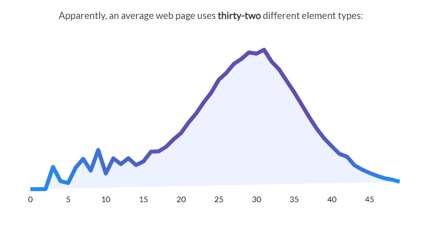
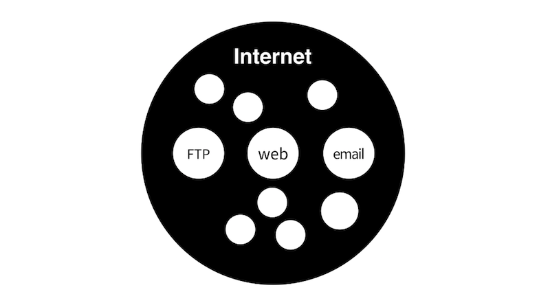
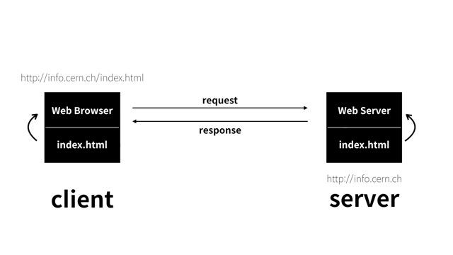
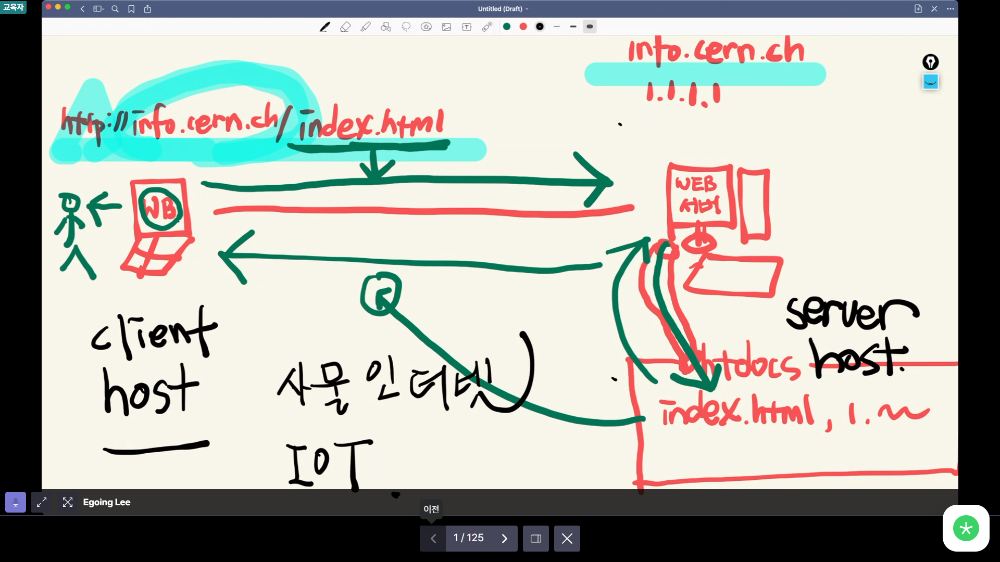
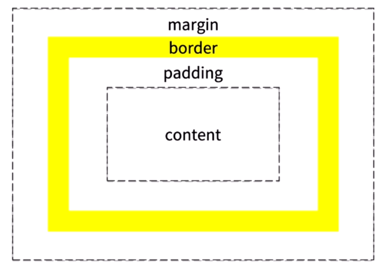

# 1주차 웹 프로그래밍
## 0404 | 월요일 실시간 집체 강의
[참고 - 이미지 사이트](https://unsplash.com/)
[참고 - 세계 최초의 웹사이트](http://info.cern.ch/)
[참고 - 구글 검색 팁](https://youtu.be/By_qxt0SZlI)
[참고 - Wrapping](https://ssimplay.tistory.com/420)
### HTML 태그(Tags)
[MDN](https://developer.mozilla.org/ko/docs/Web/HTML/Element)
```html
WWW is <strong>World <u>Wide</u> WEB</strong>.
```
HTML의 Tag는 정보를 설명한다. 열리는 태그와 닫히는 태그를 가지고 있다. 정보를 설명하는 태그는 반드시 닫아주어야 한다. 닫지 않아도 되는 태그는 설명할 정보가 없는 태그들이다.
- [MDN `<strong>`](https://developer.mozilla.org/ko/docs/Web/HTML/Element/strong)
- [MDN `<u>`](https://developer.mozilla.org/ko/docs/Web/HTML/Element/u)
- [MDN `<h1>` ~ `<h6>`](https://developer.mozilla.org/ko/docs/Web/HTML/Element/Heading_Elements) [W3S `<h1>` ~ `<h6>`](https://www.w3schools.com/tags/tag_hn.asp)
- [W3S `<ol>`](https://www.w3schools.com/tags/tag_ol.asp)
  HTML에는 부모 태그(`<ol>`, `<ul>`)와 자식 태그(`<li>`)가 존재한다.
- [W3S `<ul>`](https://www.w3schools.com/tags/tag_ul.asp)
- [W3S `<li>`](https://www.w3schools.com/tags/tag_li.asp)
- [W3S `<a>`](https://www.w3schools.com/tags/tag_a.asp)
  정보가 부족하다면, `<a>` 태그는 작동하지 않는다. 즉, `<a>`의 필수 속성인 `href`에 경로를 작성해주어야 한다. 다른 웹 페이지를 연결할 수도 있지만, 같은 웹 페이지 내부에서도 이동할 수 있다.(`href="#id"`)
- [W3S `<title>`](https://www.w3schools.com/tags/tag_title.asp)
  웹 페이지의 탭의 제목을 작성한다.
- [MDN ``](https://developer.mozilla.org/ko/docs/Web/HTML/Element/img) [W3S ``](https://www.w3schools.com/tags/tag_img.asp)
- [W3S `<br />`](https://www.w3schools.com/tags/tag_br.asp)
- [W3S `<meta>`](https://www.w3schools.com/tags/tag_meta.asp)
  UTF-8 인코딩 방식으로 작성하면, 이를 알려주어야 한다.

### HTML 속성(Attributes)
```html

```

### [`<!doctype html>`](https://www.w3schools.com/tags/tag_doctype.asp)
관용적으로 삽입하는 것으로, 문서의 타입이 `HTML`임을 알려준다.

### [`<html>`](https://www.w3schools.com/tags/tag_html.asp)
`<head>`와 `<body>` 태그를 감싸는 태그로, 모든 HTML 요소의 Container가 된다.

### [`<head>`](https://www.w3schools.com/tags/tag_head.asp)
정보를 설명하는 정보로, 메타데이터로 불린다. 정보의 본문과 나누기 위해 `<head>` 태그로 구분한다.
```html
<head>
  <title>WEB - Welcome</title>
  <meta charset="utf-8">
</head>
```

### [`<body>`](https://www.w3schools.com/tags/tag_body.asp)
정보의 내용, 본문을 가지는 태그이다. 정보를 설명하는 정보와 구분하기 위해 `<body>` 태그로 구분한다.
```html
<body>
  
  <h1>WEB</h1>
  WWW is <strong>World <u>Wide</u> WEB</strong>.
  <br />
  
  
  <ol>
    <li><a href="#HTML">HTML</a></li>
    <li><a href="#CSS">CSS</a></li>
    <li><a href="#JavaScript">JavaScript</a></li>
  </ol>
  
  <ul>
    <li>VS code</li>
    <li>Git</li>
    <li>Chrome</li>
  </ul>
</body>
```

### 통계적인 Tag 활용
[참고](https://www.advancedwebranking.com/seo/html-study/)


통계에 기반한 학습이야말로 더 효율적이고 효과적인 학습 방법이다.

### WEB과 Internet
WEB(1990년)이 하나의 건물이라면, Internet(1960년 말, 미국)은 그러한 건물들이 여럿 있는 하나의 도시이다.


과거 중앙집권적인 통신 시스템을 극복하기 위해 Internet이 생겼고, 이는 분산적인 형태를 취해 하나가 파괴된다 하더라도 나머지가 역할을 수행할 수 있게끔 만들었다. 통신 장치, 케이블, 교육 등으로 인해 널리 퍼지지 못해 대학, 군대, 기업 등 엘리트 집단만 활용했다.
1990년 11월, 스위스 CERN 물리학 연구소의 팀 버너스 리에 의해 **세계 최초의 웹 브라우저**인 **WWW**(World Wide Web)를 만들고, 12월 24일, **세계 최초의 웹 서버**가 등장했다. 이후 두 컴퓨터에 각각 웹 브라우저와 웹 서버를 설치하고, IP 주소에 `info.cern.ch`라는 도메인 이름을 붙였다.

### Server와 Client
기본적으로 인터넷이 동작하기 위해서는 컴퓨터가 최소 2대 이상 있어야 한다. 즉, 서로 정보를 주고받기 위해 2대 이상이 필요한 것이다.
팀 버너스리는 2대의 컴퓨터를 장만하여, 하나는 웹 서버를 하나는 웹 브라우저를 설치했다. 이후 웹 서버 컴퓨터에 `htdocs` 디렉토리를 설치하고, `index.html`, `1.html`, `2.html`...등을 작성하고, 누군가에 요청에 따라 해당 디렉토리에서 파일을 찾게 설정했다.

웹 브라우저가 설치된 컴퓨터에서는 `http://info.cern.ch/index.html` 주소(프로토콜://서버 위치/요청 파일)로 접속하여 웹 서버에 요청하면, 웹 서버는 설정된 디렉토리에서 찾아 `index.html` 파일 내부의 내용을 응답하게 된다.
따라서 이렇게 데이터를 요청하는 컴퓨터는 **Client**, 요청을 받는 컴퓨터는 **Server**로 불리게 되었다.

결국 Internet과 WEB은 폭발적으로 동반적인 성장을 이룩했고, 지금은 모든 것이 CPU를 가지고 컴퓨터가 되어 사물 인터넷, IoT가 발전하고 있다.


### Live Server
`http://127.0.0.1:5500/Elice%20SW%20Track/WEB/index.html`
IP 주소는 0~255 사이의 숫자 4개가 `.`으로 구분된다. 이때 `127.0.0.1`은 자기 자신을 나타내는 IP 주소로 약속되어 있다.

### Hosting
인터넷에 연결된 컴퓨터 하나 하나를 호스트라고 하고, 이를 빌려주는 서비스를 호스팅 서비스라고 한다. 

## 0404 | 월요일 실습 강의
[Quiz 001 - Heading Tags](https://www.w3schools.com/tags/tag_hn.asp)
[Quiz 002 - HTML Colors](https://www.w3schools.com/html/html_colors.asp)
[Quiz 002 - CSS Inline Style / Style Tag / Style.css](https://www.w3schools.com/csS/css_howto.asp)  
[Quiz 003 - Selectors](https://www.w3schools.com/cssref/css_selectors.asp)
[Quiz 004 - backgroundColor](https://www.w3schools.com/cssref/pr_background-color.asp)
[Quiz 005 - font-family](https://www.w3schools.com/cssref/pr_font_font-family.asp)
[Quiz 006 - float](https://www.w3schools.com/cssref/pr_class_float.asp)
[Quiz 006 - clear](https://www.w3schools.com/cssref/pr_class_clear.asp)

<hr>

[참고 - color picker](https://www.w3schools.com/colors/colors_picker.asp)
[참고 - `em`](https://developer.mozilla.org/ko/docs/Learn/CSS/Building_blocks/Values_and_units) 반응형 웹 사이트 제작에 보통 활용한다.
[참고 `font-size`](https://developer.mozilla.org/ko/docs/Web/CSS/font-size) 데스크탑은 16px, 모바일은 12px이 평균적이다.

<hr>

### [CSS Colors](https://www.w3schools.com/cssref/css_colors.asp)
`Hex` , `RGB`, `HSL`, `Color Names` 총 네 가지 방식으로 표현할 수 있다.

## 0405 | 화요일 온라인 강의
### 00 배울 내용 확인하기
#### 웹 사이트를 제작할 때 고려해야 할 사항
1. 웹 표준
   웹에서 요구하는 공식 표준이나 기술 규격을 만족하는 지 여부
2. 웹 접근성
   장애 여부와 상관 없이 모두가 웹사이트를 이용할 수 있는 지 여부
3. 크로스 브라우징
   모든 브라우저와 기기에서 웹사이트가 제대로 작동하는지 여부

#### CSS 정의
HTML로 작성된 문서를 꾸미기 위해 사용하며, 문서의 레이아웃과 스타일을 정의하는 언어

#### CSS 우선순위
`!important` > HTML inline `style` > `id` > `class` or `pseudo-class` > `tagName` > 상속된 CSS

### 01 웹사이트의 정보와 디자인
#### 웹을 구성하는 요소
HTML: 웹 사이트의 정보를 표기하고 그 구조를 설계
CSS: 웹 사이트의 디자인과 스타일링
JavaScript: 웹 사이트의 동적인 효과를 부여(슬라이드, 팝업 등)

#### 웹 사이트 제작 시 고려 사항
1. **웹 표준**
   웹에서 요구하는 공식 표준이나 기술 규격을 만족하는 지 여부, 준수하면 구글에서 검색될 가능성이 높아진다.
2. **웹 접근성**
   장애 여부와 상관 없이 모두가 웹사이트를 이용할 수 있는 지 여부
3. **크로스 브라우징**
   모든 브라우저와 기기에서 웹사이트가 제대로 작동하는지 여부

**실습 01 | HTML을 구성하는 태그**
```html
<!DOCTYPE html>               <!-- html5 문서를 선언 -->
<html>                        <!-- 문서의 시작과 끝 -->
  <head>                      <!-- 웹 사이트의 요약 정보 -->
    <meta charset="utf-8" />  <!-- 문자 코드를 위한 인코딩 방식 설정 -->
    <title>...</title>        <!-- 웹 사이트의 제목 설정 -->
  </head>
  <body>                      <!-- 눈에 보이는 정보, 출력되는 정보 -->
    ...
  </body>
</html>
```
> 몇몇 태그를 제외한 대부분의 태그들은 `</ >`형태의 닫힘 태그를 작성해야 한다.

#### HTML 기본 태그
HTML: 웹 사이트에서 눈에 보이는 정보(텍스트, 이미지 등)나 특정 구역을 설정할 때 사용하는 언어.([HTML Reference](https://www.w3schools.com/tags/default.asp))

> <TagName attributes="value"> Contents </TagName>

##### ``
```html

```
정보성을 가진 이미지를 삽입하는 열린 태그이다.
- `src`: 삽입할 이미지 파일의 경로
- `alt`: 웹 사이트가 이미지를 출력하지 못한 경우 대체되는 텍스트(웹 접근성 고려)
- `width`, `height`: 이미지의 크기를 설정

##### `<h>`
```html
<h1> Contents </h1>
```
Heading의 약자로 제목이나 부제목을 표현하는 태그로, 숫자가 작을수록 중요한 정보를 가지고 있으며, 따라서 fontSize가 커진다.
주로 `<h1>`은 가장 중요한 정보를 담으므로 하나의 HTML 문서에서 한 번만 사용된다. 따라서 기업의 웹사이트에서는 다음과 같이 활용된다.
```html
<h1>
  <a>
    
  </a>
</h1>
```

##### `<p>`
```html
<p> Contents <p>
```
Paragraph의 약자로 웹 사이트의 본문 내용, 중요 정보를 담을 때 활용하는 태그이다.

##### `<ul>`
```html
<ul>
  <li>menu 1</li>
  <li>menu 2</li>
  <li>menu 3</li>
</ul>
```
Unordered List의 약자로, 순서가 없는 리스트를 생성하는 태그이다. 보통 아래와 같이 메뉴 버튼을 만들 때 사용된다.
```html
<ul>
  <li><a href="#">menu 1</a></li>
  <li><a href="#">menu 2</a></li>
  <li><a href="#">menu 3</a></li>
</ul>
```

##### `<ol>`
```html
<ol>
  <li>menu 1</li>
  <li>menu 2</li>
  <li>menu 3</li>
</ol>
```
Ordered List의 약자로, 순서가 존재하는 리스트를 생성하는 태그이다. 리스트 형식으로 표기된다.

##### `<a>`
```html
<a href="path" target="how"> Contents </a>
```
Anchor의 약자로, 링크를 연결하는 태그이다. 기본값으로, 파란색 글씨와 밑줄이 부여된다.
- `href`: 연결할 주소
- `target`: 해당 주소를 여는 방식 설정

#### 구조를 설정하는 태그
이러한 구조를 설정하는 태그들은 대다수 HTML5에서 등장했기 때문에 `!Doctype`으로 선언된 HTML 문서에서만 활용할 수 있다.
##### `<header>`, `<nav>`
```html
<header>
  <nav>
    ...
  </nav>
</header>
```
`<header>` 태그는 웹 사이트의 머리글을 담는 공간으로, 보통 가장 먼저 보여지는 것을 작업한다. 또한, 일반적으로 내부에 `<nav>` 태그(navigation)를 통해 메뉴 버튼을 담는 공간을 구성한다.
이때 주로 `<nav>` 태그 내에는 `<ul>`, `<li>`, `<a>` 태그들이 존재한다.
```html
<header>
  
  <nav>
    <ul>
      <li><a href="#">Home</a></li>
      <li><a href="#">About Me</a></li>
      <li><a href="#">Skills</a></li>
      <li><a href="#">Projects</a></li>
      <li><a href="#">Contact Me</a></li>
    </ul>
  </nav>
</header>
```

##### `<main>`, `<article>`
```html
<main role="main">
  <article>
    ...
  </article>
  
  <article>
    ...
  </article>
</main>
```
`<main>` 태그는 문서의 주요 내용을 담는 태그로, IE는 미지원하므로 `role="main"` 속성을 필수적으로 입력해야 한다.
`<article>` 태그는 문서의 주요 이미지나 텍스트 등의 정보를 담고 구역을 설정하는 태그로, 태그 내 구역을 대표하는 타이틀 `<h1> ~ <h6>` 태그가 존재해야만 한다.(웹 표준)

##### `<footer>`
`<footer>` 태그는 가장 하단에 들어가는 정보들을 표기할 때 사용하는 태그로, 아래와 같이 활용된다.
```html
<footer>
  <div>
    <p>주소</p>
    <p>이메일</p>
    <p>전화번호</p>
  </div>
  <div>
    <p>사업자등록번호</p></p>
    <p>통신판매업 신고번호</p>
  </div>
</footer>
```

##### `<div>`
`<div>` 태그는 임의의 공간을 만들 때 사용하는 태그이다.

#### HTML 태그의 두 가지 성격
Block Elements와 Inline Elements는 줄 바꿈 현상이 있는지, 공간에 대한 크기를 만들어낼 수 있는지, 수직적으로 배치 작업이 가능한지 여부에 따라 구분된다.
##### Block Elements
```html
<p>Hello World</p>
<p>Hello World</p>
<p>Hello World</p>
```
> Hello World
> Hello World
> Hello World

Block Elements인 `<p>`, `<h1>` 등의 태그는 아래로 줄 바꿈되며 y축 정렬 형태로 출력된다. 따라서 공간을 만들 수 있어 `width`, `height` 속성을 설정할 수 있고, 수직적인 배치 작업이 가능하다.
즉, 공간의 구성을 설정하는 태그들은 모두 Block Elements이다.

##### Inline Elements
```html
<a>Hello World</a>
<a>Hello World</a>
<a>Hello World</a>
```
> Hello World Hello World Hello World

Inline Elements인 `<a>`, `<span>` 등의 태그는 한 줄로, 즉 x축 정렬 형태로 출력된다. 따라서 공간을 만들 수 없고, 수직적인 배치 작업이 불가능하다.

#### CSS
Cascading Style Sheet의 약어로, 색상, 공간 크기, 레이아웃 배치 작업 등 웹 사이트에 대한 디자인을 담당하는 언어로, HTML로 작성된 정보를 꾸며준다.

> Selector { Property : Value; }

- Selector: 디자인을 적용할 HTML 영역으로 태그명, id 혹은 class 등으로 구성된다.
- Property: `color`, `font-size`, `background-color` 등 어떤 디자인을 적용할 지를 정의한다.
- Value: `red`, `100px`, `40%` 등 해당 디자인에서 어떤 값을 적용할 지를 구체적으로 명령한다.

```css
h1 {
  /* Property: Value; */
  font-size: 20px;
  font-family: sans-serif;
  color: blue;
  background-color: yellow;
  text-align: center;
}
```

##### CSS 적용 방식
1. Inline Style Sheet
   HTML 문서 내부의 태그 안에 `style` 속성(Attributes)를 활용해 직접 원하는 스타일을 적용한다.
   ```html
   <h1 style="color: red;">Inline Style Sheet</h1>
   ```
2. Internal Style Sheet
   HTML 문서 내부의 `<head>` 태그 내에 `<style>` 태그를 활용하여 원하는 스타일을 적용한다.
   ```html
   <head>
     <style>
       h1 { background-color: yellow; }
     </style>
   </head>
   ```
3. External Style Sheet
   HTML 문서 외부에 작성된 CSS 파일(확장자 `.css`)을 `<head>` 태그 내부에서 `<link>` 태그를 활용해 연결하여 원하는 스타일을 적용한다.
   ```html
   <head>
     <link rel="stylesheet" href="style.css" />
   </head>
   ```

HTML 문서와 CSS 문서가 따로 분리되어 관리할 수 있어 상대적으로 가독성이 높고 유지보수가 쉽기 때문에 External Style Sheet를 주로 활용한다.

**실습 06 | CSS 연동 방법**
_index.html_
```html
<!DOCTYPE html>
<html>
<head>
  <meta charset="UTF-8">
  <title>CSS 연동 방법</title>
  <style>
      h1 {color:red;}
  </style>
  <link rel="stylesheet" href="index.css">
  
</head>
<body>

  <h1 style="color:blue;">Hello world</h1>
  
</body>
</html>
```
_index.css_
```css
h1 { background-color: yellow; }
```

##### CSS Selector
HTML의 어떤 요소에 CSS를 적용할 것인지에 대한 규칙이다.
1. Type Selector
   특정 태그에 스타일을 적용한다.
   ```css
   h2 { color: red; }
   ```
2. Class Selector
   Class 이름을 가진 요소에 스타일을 적용한다.
   ```css
   .className { color: blue; }
   ```
3. ID Selector
   ID를 가진 요소에 스타일을 적용한다.
   ```css
   #idName { color: green; }
   ```

**실습 07 | CSS 선택자**

```html
<!DOCTYPE html>
<html>
<head>
  <meta charset="UTF-8">
  <title>CSS 선택자</title>
  <style>
    h2 { color: red; }
    .coding { color: green; }
    #coding { color: yellow; }
  </style>
</head>
<body>
  <h2>Type Hello World</h2>
  <h2 class="coding">Class Hello World</h2>
  <h2 id="coding">Id Hello World</h2>
</body>
</html>
```

##### CSS 부모 자식 관계
```html
<header>
  <h1>Header h1</h1>
  <p>Header p</p>
</header>

<footer>
  <h1>Footer h1</h1>
  <p>Footer p</p>
</footer>
```
위 예시에서 `<header>`와 `<h1>`, `<p>`는 부모 자식 관계이고, `<h1>`, `<p>`는 형제 관계이다. 이때 `<header>`에 적용된 CSS 스타일은 자식 관계에 있는 `<h1>`, `<p>`의 두 태그에도 상속된다.(참고 | 모든 속성이 상속되지는 아니한다. 또한, 다른 스타일이 직접 적용되는 경우 상속받은 스타일에 우선한다.)

또한, CSS를 적용할 때 원하는 지역의 해당 태그에만 스타일을 적용하기 위해 부모 태그를 공백으로 구분하여 구체적으로 표기할 수 있다.
```css
header { color: red; }
header h1 { color: blue; }
header p { color: green; }
```

**실습 08 | CSS 속성의 상속**
```html
<!DOCTYPE html>
<html>
<head>
  <meta charset="UTF-8">
  <title>CSS 속성의 상속</title>
  <style>
    header h2 { color: blue; }
    header p { color: red; }
    footer h2 { color: black; }
    footer p { color: green; }
  </style>
</head>
<body>
  <header>
    <h2>Header H2</h2>
    <p>Header P</p>
  </header>
  <footer>
    <h2>Footer H2</h2>
    <p>Footer P</p>
  </footer>
</body>
</html>
```

##### Cascading
CSS의 우선순위를 Cascading이라 부른다.
1. 순서에 의한 Cascading
   나중에 적용된 CSS의 우선순위가 높다.
   ```css
   p { color: red; }
   p { color: blue; }
   ```
2. 디테일에 의한 Cascading
   더 구체적으로 작성된 선택자의 우선순위가 높다.
   ```css
   header p { color: red; }
   p { color: blue; }
   ```
3. 선택자에 의한 Cascading
   style 속성 > id > class > type 순으로 우선순위가 높다.
   ```html
   <h3 style="color: pink;" id="color" class="color">H3</h3>
   ```
   ```css
   #color { color: blue; }
   .color { color: red; }
   h3 { color: green; }
   ```

**실습 09 | CSS 우선순위**
```html
<!DOCTYPE html>
<html>
<head>
  <meta charset="UTF-8">
  <title>CSS 우선 순위</title>
  <style>
    p { color: red; }
    p { color: blue; }

    h3 { background-color: red; }
    header h3 { background-color: green; }
  </style>
</head>
<body>
  <p>순서 캐스케이딩</p>
  <header>
      <h3>디테일 캐스케이딩</h3>
  </header>
  <h4 style = "color:green;" id="color" class="color">선택자 캐스케이딩</h4>
</body>
</html>
```

##### CSS 주요 속성
1. `width`, `height`
   선택한 요소의 너비와 높이를 설정하는 속성으로 고정값 `px`와 가변값 `%`(부모가 기준) 등의 단위를 활용한다.
   ```css
   div {
     width: 100px;
     height: 50%;
   }
   ```
2. `font`
   글꼴에 대한 설정을 하는 속성이다.
   - `font-family`의 경우 입력한 대로 우선순위가 적용된다.
   - `font-weight`의 경우 `keyword` 혹은 `100 ~ 900`을 속성 값으로 갖는다.
   ```css
   .paragraph {
     font-size: 50px;
     font-family: Arial, sans-serif;
     font-style: italic;
     font-weight: bold;
   }
   ```
3. `border`
   테두리에 대한 설정을 하는 속성이다.
   - `border-style`: 테두리 선의 종류를 설정(`solid`, `dotted` 등)
   - `border-width`: 테두리의 굵기를 설정
   - `border-color`: 테두리의 색상을 설정
   - `border` 단축 속성으로 설정할 수도 있다.
   ```css
   .paragraph {
     width: 500px;
     height: 500px;
     border-style: solid;
     border-width: 10px;
     border-color: red;
     /* border: solid 10px red; */
   }
   ```
4. `background`
   특정 영역에서 배경에 대한 설정을 하는 속성이다.
   - `background-color`: 배경 색상을 설정
   - `background-image`: 배경 이미지를 설정
   - `background-repeat`: 배경 이미지의 반복 효과를 설정
   - `background-position`: 특정 공간 내부의 이미지의 좌표를 설정(`top`, `bottom`, `center` 등)
   ```css
   .paragraph {
     width: 500px;
     height: 500px;
     background-color: yellow;
     background-image: url(path);
     background-repeat: no-repeat;
     background-position: left;
     /* background: yellow url(path) no-repeat left; */
   }
   ```

**실습 10 | CSS 주요 속성**
```html
<!DOCTYPE html>
<html>
<head>
  <meta charset="UTF-8">
  <title>CSS 주요 속성 1</title>
  
  <style>
    .paragraph {
      width: 500px;
      height: 500px;
      background-color: green;
      font-size: 50px;
      font-style: italic;
      font-family: Times, Arial, sans-serif;
    }
  </style>
  
</head>
<body>
  
  <h1 class="paragraph">Nice to meet you</h1>
  
</body>
</html>
```

**실습 11 | CSS 주요 속성**
```html
<!DOCTYPE html>
<html>
<head>
  <meta charset="UTF-8">
  <title>CSS 주요 속성 2</title>
  
  <style>
    
    .paragraph {
      width: 500px;
      height: 500px;
      
      font-size; 50px;
      font-weight: bold;
      font-style: italic;
      font-family: Arial, times, sans-serif;
      
      border: solid 2px red;
      background: yellow url(elice_logo.png) no-repeat center;
    }
    
  </style>
  
</head>
<body>
  
  <h1 class="paragraph">Nice to meet you</h1>
  
</body>
</html>
```

### 02 웹 사이트 레이아웃에 영향을 미치는 요소
#### Box Model

`border`를 기준으로 외부 여백은 `margin`, 내부 여백은 `padding`이 된다.
```css
div {
  /* top right bottom left 순서 */
  margin: 100px 0 0 100px;
  padding: 30px 20px 25px 20px;
}
```
`padding`을 활용해 배치를 변경하는 경우, 전체 크기가 변할 수 있음에 유의해야 한다.

**실습 01 | 박스 모델**
```html
<!DOCTYPE html>
<html>
<head>
  <meta charset="UTF-8">
  <title>박스모델</title>
  <style>
    div {
      width: 300px;
      height: 300px;
      background-color: yellow;
      border: solid 10px red;
      margin-left: 100px;
      /* margin: 100px 0 0 100px */
      padding-left: 100px;
      /* padding: 0 0 0 100px */
    }
  </style>
</head>
<body>
  <div>Hello World</div>
</body>
</html>
```

#### Block & Inline
1. Block Elements
   `<p>`, `<h1> ~ <h6>`, `<div>`, `<header>` 등의 태그와 같이 줄 바꿈 현상이 발생하고, `width`, `height` 값을 사용해 공간을 만들 수 있으며 `margin`, `padding` 값을 사용해 상하 배치 작업이 가능한 요소를 Block Element라고 한다.
2. Inline Elements
   `<a>`, `<span>` 등의 태그와 같이 줄 바꿈 현상이 없고, `width`, `height` 값을 활용할 수 없으며, `margin-top`, `margin-bottom`, `padding-top`, `padding-bottom`을 활용할 수 없어 상하 배치 작업이 불가능한 요소를 Inline Elements라고 한다.

**실습 02 | Block Elements & Inline Elements**
```html
<!DOCTYPE html>
<html>
<head>
  <meta charset="UTF-8">
  <title>Block 요소와 Inline 요소</title>
  <style>
    p {
      width: 200px;
      height: 200px;
      background-color: yellow;
      margin-top: 100px;
    }

    a {
      width: 200px;
      height: 200px;
      background-color: pink;
      margin-top: 100px;
    }
  </style>
</head>
<body>

  <!-- Block 요소 -->
  <p>Block 요소</p>
  <p>Block 요소</p>
  <p>Block 요소</p>
  
  <!-- Inline 요소 -->
  <a href="#">Inline 요소</a>
  <a href="#">Inline 요소</a>
  <a href="#">Inline 요소</a>

</body>
</html>
```

#### `margin` 병합 현상
1. 형제지간의 `margin` 병합
   ```html
   <div class="box1">1</div>
   <div class="box2">2</div>
   ```
   ```css
   .box1 { margin-bottom: 150px; }
   .box2 { margin-top: 100px; }
   ```
   `margin-bottom`과 `margin-top` 중 더 큰 값으로 적용된다.
2. 부모지간의 `margin` 병합
   ```html
   <main role="main">
     <article></article>
   </main>
   ```
   ```css
   article {
     width: 200px;
     height: 200px;
     margin-top: 100px;
   }
   ```
   `<article>` 뿐만 아니라 부모인 `<main>`에도 영향을 미친다. 이때 `<article>`, 즉 자식 요소에 `position` 속성을 `absolute`로 설정하면 `margin` 병합을 해소할 수 있다.

**실습 03 | `margin` 병합**
```html
<!DOCTYPE html>
<html>
<head>
  <meta charset="UTF-8">
  <title>마진병합현상</title>
  <style>
    /* #box1 {
      width: 100%;
      height: 200px;
      background-color: yellow;
      margin-bottom: 150px;
    }
    #box2 {
      width: 100%;
      height: 200px;
      background-color: pink;
      margin-top: 100px;
    }   */
    main {
      width: 100%;
      height: 400px;
      background-color: yellow;
    }
    article {
      width: 100px;
      height: 100px;
      background-color: red;
      margin-top: 100px;
    }
  </style>
</head>
<body>
  <!-- 형제 지간에 발생하는 마진 병합 현상 -->
  <div id="box1"></div>
  <div id="box2"></div>
  <!-- 부모 자식 지간에 발생하는 마진 병합 현상 -->
  <main role="main">  
    <article></article>
  </main>
</body>
</html>
```

#### 레이아웃에 영향을 미치는 속성
1. `display`
   Block Elements와 Inline Elements의 성격을 바꿀 때 사용한다. `inline-block`을 활용하면 두 요소의 성격을 모두 가질 수 있다.
   ```css
   p { display: inline; }
   a { display: block; }
   a { display: inline-block; }
   ```
2. `float`
   이름 그대로 요소를 띄워 새로운 레이어 층을 만드는 것이다. 이는 선택한 요소를 좌우측에서부터 정렬시키고자 할 때 사용한다. 즉, 연속적으로 `float`을 `left` 값을 부여하면 좌측 정렬이 된다. 다만, 부모 요소의 `width`에 따라 좌우측 정렬이 정해진다.(만약 두 자식 요소보다 너비가 작다면 레이아웃이 틀어지게 된다.)
   ```css
      .left { float: left; }
   .right { float: right; }
   ```
3. `clear`
   `float`에 대한 속성을 제어하고자 할 때 사용한다. 이는 마지막으로 `float` 속성을 활용한 요소 이후의 요소에 삽입한다.
   ```html
   <header></header>
   <aside class="left">Hello</aside>
   <main></main>
   <aside class="right">World</aside>
   <footer></footer>
   ```
   ```css
   .left { float: left; }
   .right { float: right; }
   footer { clear: both; }
   ```
4. 브라우저와 공간 사이의 공백 제거하기
   기본적으로 `<html>`, `<body>` 태그는 `margin`, `padding`을 가지고 있어 초기화해주어야 한다.
   ```css
   html, body {
     margin: 0;
     padding: 0;
   }
   ```
   혹은 `*` 선택자를 활용해 모든 태그를 선택한 후 초기화해줄 수 있다.
   ```css
   * {
     margin: 0;
     padding: 0;
   }
   ```

**실습 04 | `display`**
```html
<!DOCTYPE html>
<html>
<head>
  <meta charset="UTF-8">
  <title>레이아웃에 영향을 미치는 속성 : display</title>
  <style>
    p {
      width: 300px;
      height: 300px;
      background-color: pink;
      display: inline;
    }
    a {
      width: 300px;
      height: 300px;
      background-color: yellow;
      display: block;
    }
  </style>
</head>
<body>
   <p>Block Element</p>
   <p>Block Element</p>
   <p>Block Element</p>
   <a href="#">Inline Element</a>
   <a href="#">Inline Element</a>
   <a href="#">Inline Element</a>
</body>
</html>
```

**실습 05 | `float`**
```html
<!DOCTYPE html>
<html>
<head>
  <meta charset="UTF-8">
  <title>레이아웃에 영향을 미치는 속성 - float</title>
  <style>
    /* .left {  
      width: 300px;
      height: 300px;
      background-color: yellow;
      float: left;
    }
    .right {
      width: 300px;
      height: 400px;
      background-color: blue;
      float: right;
    } */
    
    header {
      width: 100%;
      height: 100px;
      background-color: yellow;
    }
    #left {
      width: 200px;
      height: 200px;
      background-color: red;
      float: left;
    }
    main {
      width: 300px;
      height: 200px;
      background-color: green;
      float: left;
    }
    #right {
      width: 200px;
      height: 200px;
      background-color: pink;
      float: right;
    }
    footer {
      width: 100%;
      height: 100px;
      background-color: black;
    }
   
  </style>
</head>
<body>
  <!-- <div class="left"></div>
  <div class="right"></div> -->
  <!-- 전통적인 웹사이트 레이아웃 구조 만들기 -->
  
  <header></header>
  <article id="left"></article>
  <main></main>
  <article id="right"></article>
  <footer></footer>
 
</body>
</html>
```

**실습 06 | `clear`**
```html
<!DOCTYPE html>
<html>
<head>
  <meta charset="UTF-8">
  <title>레이아웃에 영향을 미치는 속성 - clear</title>
  <style>
    html, body {
      margin: 0;
      padding: 0;
    }

    header {
      width: 100%;
      height: 100px;
      background-color: yellow;
    }
    
    #left {
      float: left;
      width: 200px;
      height: 200px;
      background-color: red;
    }
    
    main {
      float: left;
      width: 300px;
      height: 200px;
      background-color: green;
    }
    
    #right {
      float: right;
      width: 200px;
      height: 200px;
      background-color: pink;
    }
    
    footer {
      clear: both;
      width: 100%;
      height: 100px;
      background-color: black;
    }
  </style>
</head>
<body>
  <header></header>
  <article id="left"></article>
  <main role="main"></main>
  <article id="right"></article>
  <footer></footer>
</body>
</html>
```

**실습 07 | 쇼핑몰 상단 영역 만들기**
```html
<!DOCTYPE html>
<html>
<head>
  <meta charset="UTF-8">
  <title>쇼핑몰 상단 만들기</title>
  <style>
    * {
        margin: 0;
        padding: 0;
    }

    .container {
        width: 960px;
    }

    ol, ul {
        list-style: none;
    }

    a {
        color: black;
        /* a 태그 정상화 */
        text-decoration: none;
    }

    #intro {
        width: 100%;
        height: 80px;
    }

    #intro h1 {
        float: left;
        width: 50%;
        height: 80px;
        background-color: #fbfbfb;
    }

    #intro h1 a {
        display: block;
        padding: 22px 0 0 30px;
        font-size: 30px;
    }

    #intro nav {
        float: right;
        width: 50%;
        height: 80px;
        background-color: pink;
    }

    #intro nav ul li {
        width: 33.33333%;
        height: 80px;
        /* inline-block 활용시 약간의 여백 존재 */
        float: left;
        /* x, y축 가운데 정렬 */
        text-align: center;
        line-height: 80px;
    }

    #intro nav ul li.one {
        background-color: #efeff6;
    }

    #intro nav ul li.two {
        background-color: #dcdcec;
    }

    #intro nav ul li.three {
        background-color: #cbcae3;
    }

    #intro nav ul li a {
        font-size: 20px;
        font-weight: bold;
    }
  </style>
</head>
<body>
  <div class="container">
    <header id="intro">
        <h1>
            <a href="https://academy.elice.io/">엘리스 사전</a>
        </h1>
        <nav>
            <ul>
                <li class="one"><a href="#">캐릭터 소개</a></li>
                <li class="two"><a href="#">줄거리</a></li>
                <li class="three"><a href="#">부록</a></li>
            </ul>
        </nav>
    </header>
  </div>
</body>
</html>
```

**실습 08 | 쇼핑몰 본문 영역 만들기**
```html
<!DOCTYPE html>
<html>
<head>
  <meta charset="UTF-8">
  <title>쇼핑몰 본문 만들기</title>
  <style>
    /* Default CSS */
    * {
        margin: 0;
        padding: 0;
    }

    img {
    /* 수직 정렬(inline 요소만 -> img 태그의 태생적인 공백 제거) */
        vertical-align: middle;
    }

    /* HEADER */
    a {
        text-decoration: none;
        color: #000;
    }

    ol, ul {
        list-style: none;
    }

    .container {
        width: 960px;
    }

    /* header CSS */
    #intro {
        width: 100%;
        height: 80px;
        background-color: yellow;
    }

    #intro h1 {
        float: left;

        width: 50%;
        height: 80px;
        background-color: #fbfbfb;
    }

    #intro h1 a {
        display: block;
        
        padding: 22px 0 0 30px;
        font-size: 30px;
    }

    #intro nav {
        float: right;

        width: 50%;
        height: 80px;
        background-color: pink;
    }

    #intro nav ul li {
        width: 33.33333%;
        height: 80px;
        
        /* display: inline-block;*/
        float: left;
        
        text-align: center;
        
        line-height: 80px;
    }

    #intro nav ul li.one {
        background-color: #efeff6;
    }

    #intro nav ul li.two {
        background-color: #dcdcec;
    }

    #intro nav ul li.three {
        background-color: #cbcae3;
    }

    #intro nav ul li a {
        font-size: 20px; 
        font-weight: bold;
    }

    /* MAIN */
    #main article {
        width: 50%;
        height: 320px;
        float: left;
    }

    #main article a {
        display: block;
        width: 100%;
        height: 100%;
    }

    #main article.one {
        background-color: #532fa1;
    }

    #main article.two {
        background-color: #a44789;
    }

    #main article.three {
        background-color: #3ab6bc;
    }

    #main article img {
        width: 100%;
    }

    #main article h2 {
        color: #ffffff;
        font-size: 25px;
        text-align: center;
        padding: 10px 0;
    }

    #main article.text {
        width: 100%;
        height: 66px;
    }

    #main article.text p {
        text-align: center;
        font-size: 20px;
        font-weight: bold;
        padding: 20px 0;
        border: solid 1px #000000;
    }
  </style>
</head>
<body>
  <div class="container">
    <header id="intro">
        <h1>
            <a href="https://academy.elice.io/">엘리스 사전</a>
        </h1>
        <nav>
            <ul>
                <li class="one"><a href="#">캐릭터 소개</a></li>
                <li class="two"><a href="#">줄거리</a></li>
                <li class="three"><a href="#">부록</a></li>
            </ul>
        </nav>
    </header>
    <main role="main" id="main">
        <article class="one">
            <a href="#">
                
                <h2>하얀토끼</h2>
            </a>
        </article>
        <article class="two">
            <a href="#">
                
                <h2>체셔 고양이</h2>
            </a>
        </article>
        <article class="three">
            <a href="#">
                
                <h2>하트여왕</h2>
            </a>
        </article>
        <article class="one">
            <a href="#">
                
                <h2>모자장수</h2>
            </a>
        </article>
        <article class="text">
            <p>엘리스에 오신 여러분 환영합니다! :)</p>
        </article>
        <article class="two">
            <a href="#">
                
                <h2>도도새</h2>
            </a>
        </article>
        <article class="three">
            <a href="#">
                
                <h2>애벌레</h2>
            </a>
        </article>
        <article class="one">
            <a href="#">
                
                <h2>카드병정</h2>
            </a>
        </article>
        <article class="two">
            <a href="#">
                
                <h2>황금열쇠</h2>
            </a>
        </article>
    </main>
  </div>
</body>
</html>
```

**실습 09 | 쇼핑몰 하단 영역 만들기**
```html
<!DOCTYPE html>
<html>
<head>
  <meta charset="UTF-8">
  <title>쇼핑몰 하단 만들기</title>
  <style>
    /* Default CSS */
    * {
        margin: 0;
        padding: 0;
    }

    img {
        vertical-align: middle;
    }

    a {
        text-decoration: none;
        color: #000;
    }

    ol, ul {
        list-style: none;
    }

    .container {
        width: 960px;
    }

    /* header CSS */
    #intro {
        width: 100%;
        height: 80px;
        background-color: yellow;
    }

    #intro h1 {
        float: left;

        width: 50%;
        height: 80px;
        background-color: #fbfbfb;
    }

    #intro h1 a {
        display: block;
        
        padding: 22px 0 0 30px;
        font-size: 30px;
    }

    #intro nav {
        float: right;

        width: 50%;
        height: 80px;
        background-color: pink;
    }

    #intro nav ul li {
        width: 33.33333%;
        height: 80px;
        
        /* display: inline-block;*/
        float: left;
        
        text-align: center;
        
        line-height: 80px;
    }

    #intro nav ul li.one {
        background-color: #efeff6;
    }

    #intro nav ul li.two {
        background-color: #dcdcec;
    }

    #intro nav ul li.three {
        background-color: #cbcae3;
    }

    #intro nav ul li a {
        font-size: 20px; font-weight: bold;
    }


    /* Main CSS */
    #main article {
        width: 50%;
        height: 320px;
        
        float: left;
    }

    #main article a {
        display: block; 
        
        width: 100%;
        height: 100%;
    }

    #main article.one {
        background-color: #532fa1;
    }

    #main article.two {
        background-color: #a44789;
    }

    #main article.three {
        background-color: #3ab6bc;
    }

    #main article img {
        width: 100%;
    }

    #main article h2 {
        color: #fff;
        font-size: 25px;
        
        text-align: center;
        padding: 10px 0;
    }

    #main article.text {
        width: 100%;
        height: 66px;
    }

    #main article.text p {
        text-align: center;
        font-size: 20px;
        font-weight: bold;
        
        padding: 20px 0;
        
        border: solid 1px #000;
    }

    #footer {
        clear: both;
        width: 100%;
        height: 80px;
        background-color: #f9f9f9;
    }

    #footer .copyright {
        width: 50%;
        float: left;
    }

    #footer .copyright p {
        font-size: 14px;
        color: #999999;
        padding: 32px 0 0 40px;
    }

    #footer .address {
        width: 50%;
        float: right;
    }

    #footer .address p {
        font-size: 14px;
        color: #999999;
        padding: 32px 40px 0 0;
        text-align: right;
    }
  </style>
</head>
<body>
  <div class="container">
    <header id="intro">
        <h1>
            <a href="https://academy.elice.io/">엘리스 사전</a>
        </h1>
        <nav>
            <ul>
                <li class="one"><a href="#">캐릭터 소개</a></li>
                <li class="two"><a href="#">줄거리</a></li>
                <li class="three"><a href="#">부록</a></li>
            </ul>
        </nav>
    </header>
    <main role="main" id="main">
        <article class="one">
            <a href="#">
                
                <h2>하얀토끼</h2>
            </a>
        </article>
        <article class="two">
            <a href="#">
                
                <h2>체셔 고양이</h2>
            </a>
        </article>
        <article class="three">
            <a href="#">
                
                <h2>하트여왕</h2>
            </a>
        </article>
        <article class="one">
            <a href="#">
                
                <h2>모자장수</h2>
            </a>
        </article>
        <article class="text">
            <p>엘리스에 오신 여러분 환영합니다! :)</p>
        </article>
        <article class="two">
            <a href="#">
                
                <h2>도도새</h2>
            </a>
        </article>
        <article class="three">
            <a href="#">
                
                <h2>애벌레</h2>
            </a>
        </article>
        <article class="one">
            <a href="#">
                
                <h2>카드병정</h2>
            </a>
        </article>
        <article class="two">
            <a href="#">
                
                <h2>황금열쇠</h2>
            </a>
        </article>
    </main>
    <footer id="footer">
        <div class="copyright">
            <p>Copyright © 2016-2018 elice. All rights reserved.</p>
        </div>
        <div class="address">
            <p>대전광역시 유성구 문지로 193 KAIST 문지캠퍼스 진리관 T326호</p>
        </div>
    </footer>
  </div>
</body>
</html>
```