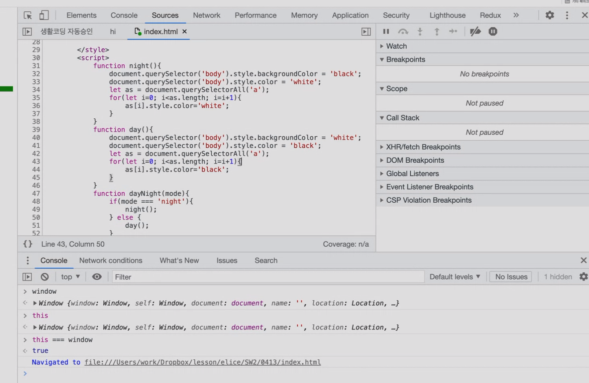

## 0418
### Review
- [Snippets](https://ko.wikipedia.org/wiki/%EC%8A%A4%EB%8B%88%ED%8E%AB): 재사용 가능한 소스 코드, 기계어, 텍스트의 작은 부분으로, 사용자가 루틴 편집 조작 중 반복 타이핑을 회피할 수 있게 도와준다. 브라우저 Console에서 하는 작업의 휘발성 문제를 대체할 수 있는 방안이다.
- `FileSystem` 탭의 `Add folder to workspace` 기능을 통해 브라우저 Console에서도 로컬에서 작업중인 디렉토리를 선택해 편집하고, Debug를 할 수도 있다.
- 개인적인 프로젝트를 하다보면 결국 성장할 수 있다. 보편적인 프로젝트는 일생에 한 두개 할 수 있다. 즉, 개인적인 프로젝트를 통해 실력을 쌓고, 보편적인 프로젝트의 주제를 깨달을 수도 있고 쌓은 실력을 통해 다른 보편적인 프로젝트에 참여할 수 있는 기회를 얻을 수도 있다.
- `this`: 현재 이벤트가 실행 중인 해당 태그를 선택할 때 활용한다.
- breakpoint: 해당 지점에서 코드의 진행을 일시 중단시키는 기능.
- **Console에서 Call Stack, Scope를 확인할 수 있고, Debug를 활용할 수 있다.**
  

### [jQuery CDN](https://releases.jquery.com/)
- [CDN](https://www.akamai.com/ko/our-thinking/cdn/what-is-a-cdn)([콘텐츠 전송 네트워크](https://library.gabia.com/contents/infrahosting/8985/))은 지리적으로 분산된 여러 개의 서버로, 웹 콘텐츠를 사용자와 가까운 곳에서 전송함으로써 전송 속도를 높입니다. 보통 개발할 때는 uncompressed 버전을 활용하고, 배포할 때는 minified 버전을 활용한다.

```javascript
$('body').css('background-color', 'black');  // jQuery 버전의 동일 코드
// document.querySelector('body').style.backgroundColor = 'black';

$('body').css('color', 'white');  // jQuery 버전의 동일 코드
// document.querySelector('body').style.color = 'white';
```

jQuery의 Chaining를 활용해 더 간결하고 추가적으로 더 작성할 수 있다.
```javascript
$('body').css('background-color', 'black').css('color', 'white');
```

jQuery는 반복문을 대체할 수 있다.
```javascript
$('a').css('color', 'white');

// 아래 javascript 코드와 동일함
// let as = document.querySelectorAll('a');
// for(let i=0; i<as. length; i=i+1){
// as [i).style.color='white';
// }
```