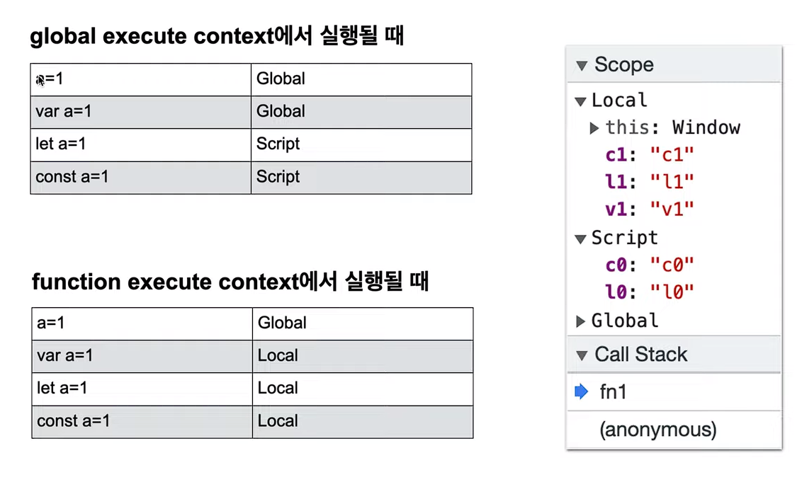

# CRUD 이해

## [p5js](https://p5js.org/ko/)
cdn을 활용해 `<script>` 태그로 설치할 수 있다.
[기타 참고 자료](https://docs.google.com/spreadsheets/d/178cIAH4C-UlYHQ24oWLW9DK7Bg91GLTOKnPYd1cXqFQ/edit#gid=1061497286)
이후 동적 배경화면, 동적 마우스 등으로 구현할 수 있을 듯 하다.

<hr />

## CRUD 구현하기([참고](https://jsbin.com/kupupakoxu/1/edit?html,output))
### 1. 기본 HTML 구조
```html
<!DOCTYPE html>
<html lang="en">
<head>
  <meta charset="UTF-8">
  <meta http-equiv="X-UA-Compatible" content="IE=edge">
  <meta name="viewport" content="width=device-width, initial-scale=1.0">
  <title>CRUD</title>
</head>
<body>
  <h1><a href="index.html">WEB</a></h1>
  <nav>
    <ol>
      <!-- 동적 변경 대상
        <li><a href="HTML.html">HTML</a></li>
        <li><a href="CSS.html">CSS</a></li>
      -->
    </ol>
  </nav>
  <article>
    <!-- 동적 변경 대상
      <h2>Welcome</h2>
      <p>Hello, WEB</p>
     -->
  </article>
  <ol id="control">
    <!-- 동적 변경 대상
      <li><a href="/create">CREATE</a></li>
      <li><a href="/update">UPDATE</a></li>
      <li><a href="/delete">DELETE</a></li>
     -->
  </ol>
  <script>
    // 함수 작성
  </script>
</body>
</html>
```

### 2. 기본 State 설계
배열이나 객체 데이터의 경우 push method를 활용해 추가할 수 있다. 단순히 재할당을 할 수 없는 것이다.
```javascript
const topics = [];            // 재할당 불가 주제 데이터 설정
let selectedId = null;        // 선택되어 있는 id 값 할당할 데이터 추가

// 각 기능 함수 구현
function nav() {    }         // Navigation Renderer
function welcome () {    }
function read() {    }
function create() {    }
function update() {    }
function del() {    }         // delete는 예약어이기 때문에 함수 이름으로 사용 불가능
function control () {    }    // UI 동적 Renderer(#control list)
```

### 3. 기본 데이터 설정
`topics` 변수에 재할당 불가능한 `const` 데이터를 설정한다.
```javascript
const topics = [
  {id: 1, title: 'HTML', body: 'HTML is ...'},
  {id: 2, title: 'CSS', body: 'CSS is ...'},
  {id: 3, title: 'JavaScript', body: 'JavaScript is ...'},
];
```
또한, 선택되어 read 함수에 의해 보여질 데이터의 id 값을 할당할 데이터를 `let` 변수로 선언한다.
```javascript
let selectedId = null;
```

이후 최초 출력을 위해 `<script>` 태그 하단에 `nav`와 `welcome` 함수를 호출해주어야 한다.
```javascript
nav();
welcome();
```

### 4. Navigation Renderer 구현
배열로 선언되어 있는 `topics` 데이터의 각 원소에 대해서 `Array.prototype.map()`을 통해 콜백 함수를 호출하여 Template Literal을 활용해 `<li>`, `<a>` 태그를 삽입할 수 있다. 다만, 이때 각 원소 별로 생성된 `<li>`, `<a>` 태그를 `Array.prototype.join()`을 통해 string으로 합쳐야 한다.

추가적으로 화살표 함수(Arrow Function)를 활용해 간결하게 작성할 수 있다.
```javascript
// Navigation Renderer
function nav() {
  const tag = topics.map(el => `<li><a href='/read/${el.id}.html' id='${el.id}' onclick='navHandler(event);'>${el.title}</a></li>`).join(" ");

  document.querySelector('nav>ol').innerHTML = tag;
}
```
이후 생성한 `<li>`, `<a>` 태그 모음을 `<nav>` 태그 내의 `<ol>` 태그 바로 아래에 `innerHTML`을 통해 렌더링한다.

### 5. Navigation List click Event Handler 설정
4번에서 생성한 Navigation의 `<a>` 태그에 대해 해당 항목을 클릭하는 경우에 해당 항목의 `title`과 `body`를 조회하는 기능을 구현하기 위해서 Event Handler를 추가해주어야 한다.

#### Event Handler의 동작 순서
1. 클릭하는 경우, 페이지 링크가 작동 하지 않아야 한다.
2. `id` 값을 가져와야 한다.
3. `id` 값과 일치하는 `topics`의 원소를 찾아야 한다.
4. 찾은 원소의 `title`과 `body`를 조회하여 작성하고 렌더링한다

```javascript
// Navigation list click event handler 선언
function navHandler(e) {
  e.preventDefault();             // (1) 링크 작동을 막는다.
  selectedId = +e.target.id;      // (2) id 값을 추출한다. ( +e.target.id => from String to Number )

  read();   // (3) ~ (4) 작업은 추후 반복될 여지가 있어 독립적인 하나의 `read()` 함수로 설계하고 생성한 후 호출한다.
}
```

### 6. Read 기능 설정
`Array.prototype.filter()`를 활용해 5번에서 찾은 `id` 값과 동일한 원소를 찾아 `<h2>` 태그에 `title` 데이터를, `<p>` 태그에 `body` 데이터를 담아 이를 `<article>` 태그에 삽입한다.

이때 사용하는 배열의 `Array.prototype.filter()` method는 콜백 함수는 일치할 때 `true`, 일치하지 않을 때 `false`를 반환한다. 즉, 콜백 함수의 `return` 값이 `true`인 원소만으로 담은 배열을 반환한다.(원본 배열을 수정하지 않는다.)
```javascript
// Nav Handler에서 호출될 예정
function read() {
  // (3) `id` 값과 일치하는 `topics`의 원소를 찾아야 한다.
  // topics.filter(el => { if (el.id === selectedId) { return true; } else { return false; } });의 축약
  const topic = topics.filter(el => el.id === selectedId);
  // 다른 방법: const topic = topics.filter(el => el.id === selectedId)[0];
  
  // (4) - 1 찾은 원소의 `title`과 `body`를 조회화기
  const content = `<h2>${topic[0].title}</h2><p>${topic[0].body}</p>`
  // 다른 방법: const content = `<h2>${topic.title}</h2><p>${topic.body}</p>`
  
  // (4) - 2 렌더링 하기
  document.querySelector('article').innerHTML = content;
}
```

### 7. CRUD 기능 관련 UI 생성
CRUD 기능 관련 UI의 경우 개발 정책에 따라 노출 여부가 달라진다. 여기서는, 최초 출력시 `Create` 버튼만이 출력되나, 이후 데이터를 조회하는 경우, 즉 다음과 같은 경우에 `Update`, `Delete` 버튼을 노출하는 것으로 설정한다.
> `selectedId`가 존재하는 경우에만 `Update`, `Delete` 노출.

우선, `contextUI`는 `selectedId`가 존재하는 경우에만 노출될 것이기에 없는 경우 빈 문자열로 설정한다. 이후, `Create` 버튼과 함께 `<ul>` 태그 내부에 렌더링한다.
```javascript
function control () {
  let contextUI = (selectedId !== null) ?
    contextUI = `
      <li><a href=''>Update</a></li>
      <li><a href=''>Delete</a></li>
    ` : '';
  
  document.querySelector('#control').innerHTML = `
    <li><a href='' onclick='event.preventDefault(); create();'>Create</a></li>
    ${contextUI}
  `;
};
```
이때, 데이터 삽입 기능 즉, `Create` 기능을 위한 UI를 로드하기 위해 해당 버튼에 click Event Handler를 삽입하고, `<a>` 태그의 기본 동작을 막은 후, UI를 구현하는 `create()` 함수를 호출한다.

### 8. Create UI 구현 함수 설정
7번에서 구현한 `Create` 버튼 클릭 시 `<form>` 태그로 구성된 입력 창 UI를 열어주고, `submit`하는 경우에 해당 Event를 받은 Event Handler를 연결해주어야 한다. 이때 각각을 `<p>` 태그로 감싸 `<input>`과 `<textarea>`을 수직으로 구현해야 하는 점에 유의해야 한다.
```javascript
function create() {
  const createUI = `
    <form onsubmit='createHandler(event);'>
      <p><input type='text' name='title' placeholder='title' /></p>
      <p><textarea name='body' placeholder='content'></textarea></p>
      <p><input type='submit' value='create' /></p>
    </form>
  `;
  document.querySelector('article').innerHTML = createUI;
}
```

### 9. Create Submit Event Handler 기능 구현
Create 버튼에 대해 submit 이벤트 발생 시 우선 `topics`에 새로운 원소 `topic`이 추가된다. 이후 Navigation List을 다시 렌더링하여 추가된 `topic`을 보여준다. 그 다음 데이터가 추가될 것을 위해서 `id` 값을 `1` 늘려주고, 마지막으로 추가된 데이터에 대한 상세 조회 데이터를 열어준다.
```javascript
function createHandler(e) {
  e.preventDefault();
  const t = e.target.title.value;
  const b = e.target.body.value;
  const newTopic = {id: nextId,title: t, body: b};
  topics.push(newTopic);

  // navigation list 새로고침
  nav();

  // 다음 추가를 위해 +1
  selectedId = nextId;
  nextId++;

  // 상세 조회로 이동 및 UI 창 제거 < parameter로 selectedId 추가하는 것이 훨 나음
  read();
}
```

### 미 구현 기능
- `delete`
- `update`
- 추가적인 CSS

### 추가 기능 구현 - `welcome()` 함수 설정 및 초기 호출 함수 설정
메인 화면의 상단에 위치한 `WEB`을 클릭하는 경우, 인삿말 렌더링하는 함수를 구현한다.
```javascript
function welcome() {
  document.querySelector('article').innerHTML = `<h2>Welcome</h2><p>Hello, Web</p>`
}
```
또한, 초기 호출 함수를 구분해 `<script>` 태그 최하단에 호출해주어야 한다.
```javascript
// 최초 출력을 위한 함수 호출
nav();
welcome();
control();
```

<hr />

## [Execute Context 실행 컨텍스트](https://gist.github.com/egoing/7e8bce3f04542e061629166be91598cc)

### 변수의 Scope 이해
`n0 = n0`처럼 변수를 선언할 때 아무런 키워드 없이 변수의 이름만으로 선언한다면, 그 값은 **Global Scope**에 저장된다. 이렇게 선언된 변수를 읽고자 하면, Scope에서 변수의 값을 찾는데, JavaScript는 먼저 Script Scope에서 찾고 없다면 Global Scope에서 찾아 해당 값을 반환하게 되는 것이다.

`var`로 선언되는 변수를 저장하면, **Global Scope**에 저장된다. 이와 달리 `let`으로 선언되는 변수를 저장하면, **Script Scope**에 저장된다. `const`로 선언되는 상수도 마찬가지로 **Script Scope**에 저장된다.

웹 브라우저에서 동작하는 JavaScript는 `Window` 객체가 Global Object, Global Scope라고 할 수 있다. 즉, JavaScript는 어디에서 실행하는지와 관계없이 Global Scope이 가장 밑에 존재한다. 따라서 어느 곳에서든 **Global Scope**에 접근 가능하다.

결국, `let`과 `const`로 선언된 변수 혹은 상수는 **Script Scope**에 저장되었으므로 `window.l0`, `window.c0`로 실행하면 `Window` 객체, 즉 **Global Scope**에서는 찾을 수 없기 때문에 `undefined`를 반환한다. 

### Call Stack
Execute Context가 쌓이는 위치로, 이때 `anonymous`라고 하는 첫 번째 Call Stack은 `fn1` 함수 외부에 있는 코드들이 접근할 수 있는 Scope를 보여준다. `fn1`이라는 두 번째 Call Stack은 해당 함수에 있는 코드들이 접근할 수 있는 Scope을 보여준다.

결국, 최초로 생성되는 `anonymous`라고 하는 첫 번째 Call Stack, 즉 Execute Context는 전역에서 접근할 수 있어서 Global Execute Context라고 불린다. 함수를 위해 만들어진 두 번째 Call Stack은 Function Execute Context라고 한다.

Function Execute Context에는 Local Scope가 새로이 생성된다. 다만, 이 경우에도 여전히 변수의 이름만으로 선언하는 변수 `n1`은 이전과 동일하게 **Global Scope**에 저장되는 것을 알 수 있다.

이와 달리, `var`, `let`, `const`로 선언하는 변수나 상수는 **Local Scope**에 저장된다. 이때 함수 외부, 즉 `anonymous`, Global Execute Context에서 `var`로 선언된 `v0`를 호출하면, Local Scope에서 Script Scope, Global Scope를 모두 찾아 결국 마지막 Global Scope에서 `v0`를 찾아 값을 반환한다. 이렇게 Scope들이 연결되어 있는 현상을 **Scope Chaining**이라고 한다.

함수 내부에서 또다른 함수를 호출하는 경우, Call Stack은 실행한 순서대로 `anonymous`, `fn1`, `fn2`로 쌓인 것을 확인할 수 있다. 다만, Scope를 확인해보면 `fn1`의 Local Scope는 `fn2`의 Scope Chain 내부에 존재하지 않고, 단지 `fn2`의 Local Scope만이 존재함을 알 수 있다.

따라서 변수의 이름만으로 선언되어 Global Scope에서 저장된 변수 `n0`, `n1`, `n2`는 모두 호출이 가능하다. 이와 다르게 `var`로 선언된 변수 `v2`는 Local Scope에 저장된다.

하지만 유의해야 할 점은 Global Execute Context, 즉 함수 외부에서 선언된 `v0`는 `Window` 객체인 Global Scope에 저장되었기 때문에 Local Scope인 `fn2` 함수 내부에서도 호출이 가능하다. 이와 달리 `fn1`의 Local Scope에 저장된 변수 `v1`은 호출하면 에러를 반환한다. 이러한 부분은 `let`, `const`로 선언된 변수 `l1`, `c1`에도 동일하게 적용되어 에러를 반환한다. 참고로 Script Scope에 저장된 `l0`, `c0`는 Scope Chaining에 의해 호출할 수 있다.

마지막으로 `fn2`에서 나가면 Call Stack에서 해당 Execute Context가 제거되고, 이후 `fn1`에서 나가면 해당 Execute Context가 제거되어 `anonymous`만이 Call Stack에 존재한다.



다만, `let`과 `const`로 선언된 변수는 function Execute Context에서 뿐만 아니라 Block, 즉 중괄호 내부에서 동일하게 동작한다.

<hr />

## 