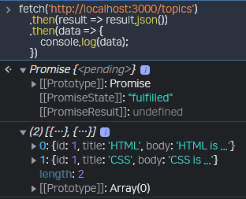
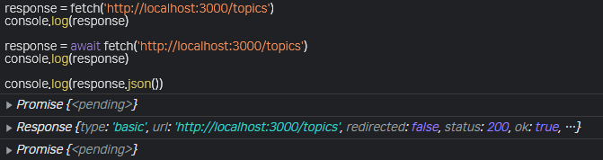

# 실시간 이론 강의

## Review

- JSON Server 실행하기

  ```command
  npx json-server --watch db.json
  ```

  내용을 수정하고, 수정한 데이터가 실시간으로 JSON server에 반영되기 위해 `--watch` 옵션을 주어야 한다. 다른 JSON server를 다른 포트에서 열기 위해서는 `--port 3001` 옵션을 추가적으로 활용해야 한다.

  JSON server에서 데이터를 가져오기 위해 fetch API를 사용해야 한다. fetch로 가져온 데이터는 `Promise` 객체이고, 따라서 `then`, `catch` 메서드를 활용할 수 있다.
  

  ```javascript
  console.log(1);
  fetch('http://localhost:3000/topics')
    .then(result => {
      console.log(2);
      result.json();                      // fetch로 가져온 데이터는 json 타입
    })
    .then(topics => {                     // 그 데이터를 처리할 콜백 함수'
      console.log(3);
      console.log(topics);                // 전체 데이터 조회
      console.log(topics[0]);             // 첫 번째 원소 조회
      console.log(topics[0].id);          // 첫 번째 원소의 id 조회
    })
  console.log(4);

  > 1, 4, 2, 3 출력                       // 비동기 작업임을 확인할 수 있다.
  ```

  이때 첫 번째 원소의 `id` 값을 활용해 해당 주소로 재접근하여 그 데이터만 확인하고자 하면 다음과 같은 과정을 거치게 된다.

  ```javascript
  fetch('http://localhost:3000/topics')
    .then(response => response.json())
    .then(topics => {
      let firstId = topics[0].id;
      fetch("http://localhost:3000/topics/" + firstId)
        .then(response => response.json())
        .then(topic => {
          console.log("topic 1: ", topic);
        })
    })
  ```

  지속적으로 서버 데이터를 더 가져온다면, 콜백 지옥에 빠지게 되는 것이다. 즉, 비동기 작업을 순차적으로 수행하는데에서 생기는 콜백 지옥을 해결하기 위해 `async`, `await`를 활용해야 한다.

- 참고

  | 참고 | 윈도우 포트 스캔 << 구글링
  | 참고 | `history` 명령어로, 작성한 모든 명령어를 확인할 수 있는데, 윈도우 powershell에서는 `Get-history` 명령어.
  | 참고 | 이해한 것은 설명할 수 있다. 다만, 익숙해진 것은 많고 이해한 것은 적으므로, 익숙해지는 것을 목표로 하자!
  | 참고 | PlantUML << 구글링

## `async`, `await`

> promise 는 미래 결과값에 대한 약속임
> await를 통해 promise의 결과값인 response를 기다림
> await가 없으면 promise(약속)만 저장
> await가 있으면 response(약속의 결과)가 저장

`async`, `await`는 비동기적인 코드를 동기적인 코드인 것처럼 바꾸는 설탕과 같다. 즉, 콜백 함수를 감추는 마법이다.

아래 기본적인 fetch 활용에서 fetch로 가져온 데이터, 즉 `http://localhost:3000/topics`에서 가져온 데이터는 이후에 나오는 then 메서드의 response 매개변수에 저장된다.

```javascript
fetch('http://localhost:3000/topics')
  .then(response => response.json())        // 데이터 타입 결정을 포함한 전처리 과정이 존재한다.
  .then(topics => {
    console.log(topics[0].id);
  })
```

이를 다음과 같이 작성할 수 있다.

```javascript
response = fetch('http://localhost:3000/topics')
```

다만, await 키워드를 작성해주지 않는다면, response 변수에는 fetch 반환 값 Promise 객체가 할당된다. await를 작성하면, then 메서드에 의해 가져온 데이터(`response`)가 할당된다.(fetch가 실행되고 나서 실행되기 때문이다.)

```javascript
response = await fetch('http://localhost:3000/topics')
```

`await`를 활용하지 않으면 단순 Promise 객체가 되고, 활용하면 상술한 `fetch(url)`의 `then` 메서드에 있는 첫 번째 매개변수가 된다. 이때 `response`에 `json()`을 활용하면 다시 Promise 객체가 반환된다.


```javascript
response = await fetch('http://localhost:3000/topics');       // fetch의 then 메서드에 있는 첫 번째 매개변수

console.log(response.json());       // Promise 객체
```

```javascript
console.log(1);
response = await fetch('http://localhost:3000/topics');
console.log(2);
topics = await response.json();
console.log(3);
console.log(topics);
console.log(4);

> 1, 2, 3, 4                  // 동기적 코드임을 확인
```

성능적으로는 비동기적 코드가 더 높을 수 있으나, 필요하지 않은데도 비동기적으로 처리하게 되는 것을 `await`를 활용해서 방지할 수 있다.

네트워크 통신, 타이머, 파일 저장 등 시간이 소요되는 CPU 외부 작업들이 대표적인 비동기의 예시이다.(*IO 작업 찾아보기)

```javascript
response = await fetch('http://localhost:3000/topics');
topics = await response.json();
response = await fetch('http://localhost:3000/topics/' + topics[0].id);
topic = await response.json();
console.log(topic)

> {id: 1, title: 'HTML', body: 'HTML is ...'}
```

`Uncaught SyntaxError: await is only valid in async functions and the top level bodies of modules` 에러가 발생한다.

`await`는 함수 내부에서 실행되는데, 그 함수는 반드시 `async` 함수여야 한다. 즉, `await`는 반드시 `async` 함수안에서 실행한다.

```javascript
  // Navigation Renderer
  async function nav() {
    document.querySelector('nav>ol').innerHTML = 'Loading...';

    const response = await fetch("http://localhost:3000/topics");
    let topics = await response.json();
    const tag = topics
                    .map(el => `<li><a href='/read/${el.id}.html' id='${el.id}' onclick='navHandler(event);'>${el.title}</a></li>`)
                    .join(" ");

    document.querySelector('nav>ol').innerHTML = tag;

    /* 
    fetch("http://localhost:3000/topics")
      .then(response => response.json())
      .then(topics => {
        // 서버로부터 데이터를 받아오고, json 데이터로 변환한 이후에 실행되는 부분
        const tag = topics
                      .map(el => `<li><a href='/read/${el.id}.html' id='${el.id}' onclick='navHandler(event);'>${el.title}</a></li>`)
                      .join(" ");

        document.querySelector('nav>ol').innerHTML = tag;
      })
    

    // fetch API가 종료되고 바로 즉시 실행되는 부분.
    document.querySelector('nav>ol').innerHTML = 'Loading...';
    */ 
  }
```

### 몰랐던 부분 체크

```javascript
response = await fetch('http://localhost:3000/topics')
// await를 하지 않는 경우, 단순히 fetch API에 의한 Promise가 response에 저장되는데, 필요한 것은 fetch API의 Promise가 성공적으로 실행되어 해당 Promise의 결과 값([[PromiseResult]]: Response)이다. 따라서, await를 통해 동기적으로 변경하면 해당 Promise가 성공적으로 종료되고, 결과 값을 가져와 response 변수에 할당할 수 있다.

console.log(response);

topics = await response.json();
// 위에서 가져온 response 변수에 할당된 fetch API에 의한 Promise의 결과 값에서 원하는 데이터를 가져오기 위해 확인해보면, body는 ReadableStream으로, JSON 객체로 변환해야 한다. 따라서 .json() 메서드를 사용하면, 데이터를 가져오고 객체로 변환하는 과정이 비동기적으로 이루어지기 때문에 또다시 await를 추가해 동기적으로 변경하여 JSON 객체로 변경된 데이터를 topics에 할당할 수 있다.

console.log(topics);
```
